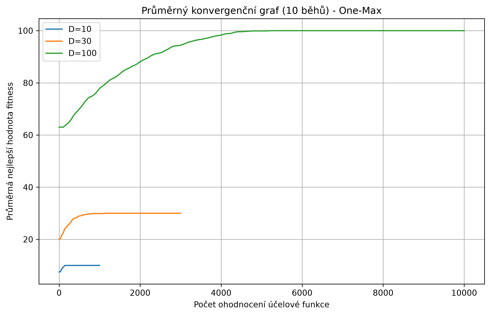
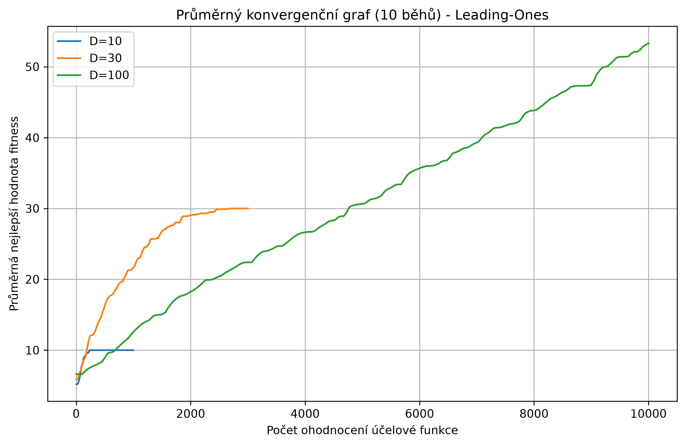

 # Úkol 1 – Genetický algoritmus pro binární problém

## Zadání

Cílem úlohy je implementovat a experimentálně ověřit genetický algoritmus pro řešení binárního optimalizačního problému. Algoritmus pracuje s populací binárních chromozomů a pomocí selekce, křížení a mutace postupně hledá co nejlepší řešení.


## Spuštění

```bash
python main.py
```

Program provede 10 běhů pro oba problémy a pro délky chromozomu 10, 30 a 100. Vytvoří grafy `one-max_graf.png` a `leading-ones_graf.png` a výsledky uloží do `statistiky_ga.csv`.


## Shrnutí výsledků

### Tabulkové výstupy

Tabulka statistik obsahuje výsledky 10 běhů pro každou kombinaci problému a délky chromozomu. Konkrétní hodnoty program vypíše do konzole a uloží do souboru `statistiky_ga.csv`.

| Problém | D | Nejlepší | Nejhorší | Průměr | Medián | Směrodatná odchylka |
|---|---:|---:|---:|---:|---:|---:|
| One-Max | 10 | 10 | 10 | 10.0 | 10.0 | 0.0 |
| One-Max | 30 | 30 | 30 | 30.0 | 30.0 | 0.0 |
| One-Max | 100 | 100 | 100 | 100.0 | 100.0 | 0.0 |
| Leading-Ones | 10 | 10 | 10 | 10.0 | 10.0 | 0.0 |
| Leading-Ones | 30 | 30 | 30 | 30.0 | 30.0 | 0.0 |
| Leading-Ones | 100 | 70 | 40 | 53.3 | 52.5 | 7.21 |

### Obrázkové výstupy

Níže jsou uvedeny grafické výstupy z aplikace. Grafy zobrazují vývoj nejlepší nebo průměrné fitness v průběhu generací.



*Obrázek 1: Vývoj fitness pro problém One-Max.*




*Obrázek 2: Vývoj fitness pro problém Leading-Ones.*


## Závěr

Z experimentů vyplývá, že zatímco jednoduchý problém One-Max algoritmus spolehlivě vyřeší ve všech dimenzích, složitější sekvenční úloha Leading-Ones pro 100D vyžaduje úpravu kontrolních parametrů. Nejlepších výsledků bylo dosaženo při použití pořadové selekce, zmenšení velikosti populace a zvýšení elitismu, což efektivně chrání nalezené souvislé bloky jedniček před zničením křížením či mutací.